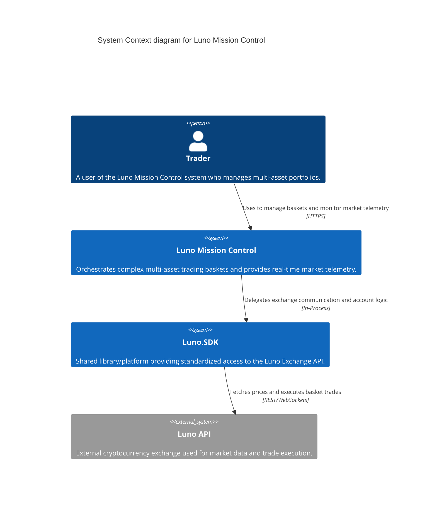

# C1: System Context Diagram

This diagram provides a high-level overview of the **Luno Mission Control** system and its interactions with users, the specialized **Luno.SDK**, and the external exchange.

