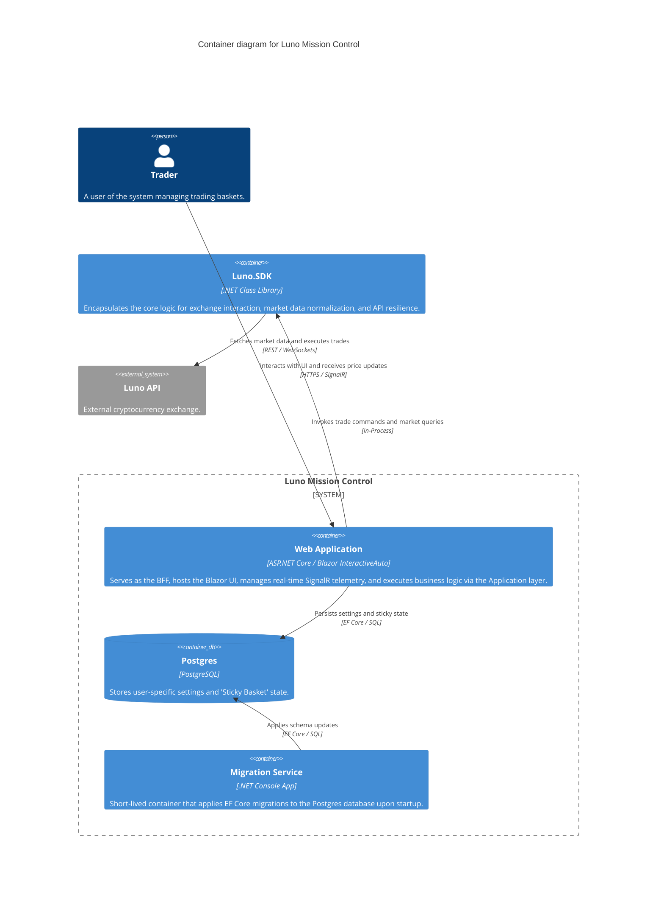

# C2: Container Diagram

This diagram zooms into the **Luno Mission Control** system to show its actual container topology and its dependency on the specialized **Luno.SDK**.

```mermaid
C4Container
    title Container diagram for Luno Mission Control

    Person(user, "Trader", "A user of the system managing trading baskets.")

    System_Boundary(c1, "Luno Mission Control") {
        Container(web_app, "Web Application", "ASP.NET Core / Blazor InteractiveAuto", "Serves as the BFF, hosts the Blazor UI, manages real-time SignalR telemetry, and executes business logic via the Application layer.")
        ContainerDb(database, "Postgres", "PostgreSQL", "Stores user-specific settings and 'Sticky Basket' state.")
        Container(migration_service, "Migration Service", ".NET Console App", "Short-lived container that applies EF Core migrations to the Postgres database upon startup.")
    }

    Container(lunoSDK, "Luno.SDK", ".NET Class Library", "Encapsulates the core logic for exchange interaction, market data normalization, and API resilience.")

    System_Ext(lunoAPI, "Luno API", "External cryptocurrency exchange.")

    Rel(user, web_app, "Interacts with UI and receives price updates", "HTTPS / SignalR")
    Rel(web_app, lunoSDK, "Invokes trade commands and market queries", "In-Process")
    Rel(lunoSDK, lunoAPI, "Fetches market data and executes trades", "REST / WebSockets")
    Rel(web_app, database, "Persists settings and sticky state", "EF Core / SQL")
    Rel(migration_service, database, "Applies schema updates", "EF Core / SQL")
```
