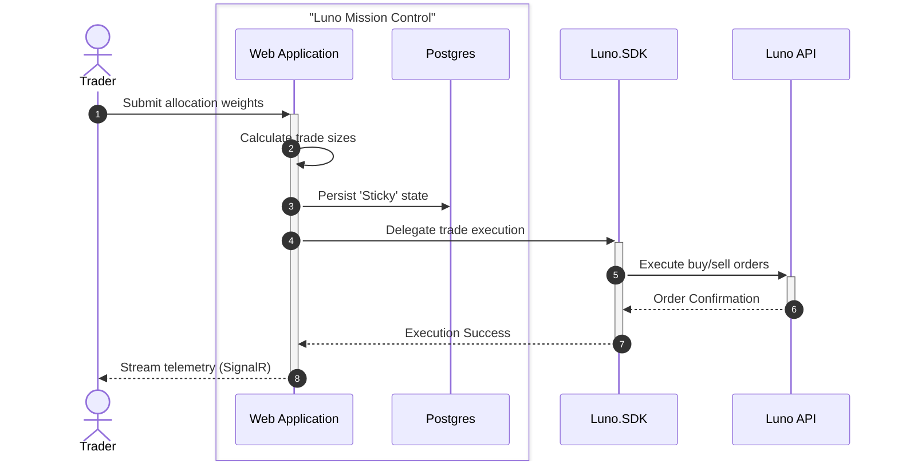
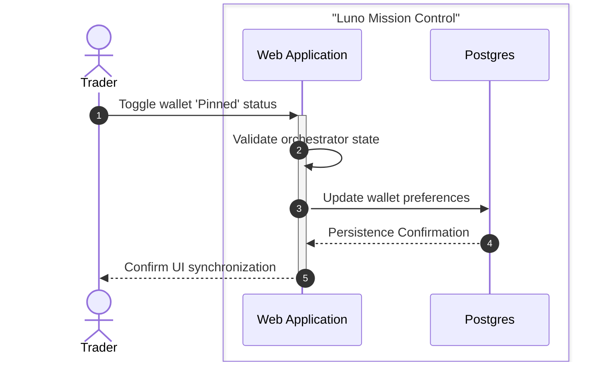

# Feature Architecture: Sequence Flows

This document visualizes the high-fidelity flows for the core features of **Luno Mission Control** using Sequence Diagrams for maximum clarity.

## 🧺 Feature: Placing Combo Orders (Allocation)
This flow describes how a Trader orchestrates a multi-asset allocation (Combo Order) across the exchange.

## 📌 Feature: Pinning Wallets
This flow describes how a Trader manages their focus by pinning specific wallets for trading.

---
