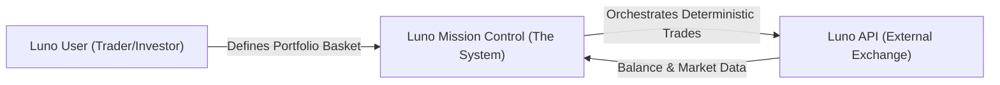
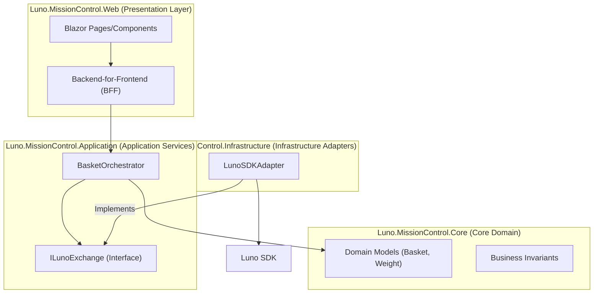

# Implementation Plan: Mission Control Architectural Refactoring

## 🏛️ Architectural Trade-offs
To achieve the goal of **Core Domain Isolation**, we are introducing a higher degree of **Architectural Decoupling**.
- **Pros**: Improved testability, strict decoupling from Luno API infrastructure, and a foundation for asynchronous background processing.
- **Cons**: Increased project count and higher initial development overhead.
This trade-off is accepted to ensure long-term maintainability and system integrity.

## 📊 C1: System Context Diagram
The system acts as a centralized management layer for the Luno API, providing portfolio orchestration logic that is absent from the native exchange platform.



## 📊 C2: Container & Layered Architecture
This diagram illustrates the separation between the **Core Domain** and the **Infrastructure/UI Adapters**.



## 🏗️ Project Structure & Architectural Mapping
Dependencies flow inward toward the **Core Domain Layer**.

### 📁 Directory Tree
```text
Luno.MissionControl/
├── .agents/
│   └── skills/ (aspire, azure-deploy)
│
├── docs/
│   └── rfcs/ (architecture-refactor, resilience)
│
├── labs/
│   └── AGENTS.md
│
├── scripts/ (ci-build.sh, cleanup-logs.sh)
│
├── Luno.MissionControl.Core/
│   ├── Models/ (Basket.cs, Weight.cs)
│   └── Exceptions/ (LunoDomainException.cs)
│
├── Luno.MissionControl.Application/
│   ├── Interfaces/ (ILunoTrader.cs, ILunoMarketData.cs)
│   └── BasketOrchestrator.cs
│
├── Luno.MissionControl.Infrastructure/
│   └── Adapters/ (LunoSDKAdapter.cs)
│
├── Luno.MissionControl.Web/
│   ├── Hubs/ (PriceHub.cs)
│   ├── Services/ (MarketWatchService.cs, ServerBasketState.cs)
│   └── Program.cs (Composition Root)
│
└── Luno.MissionControl.Web.Client/
    ├── Components/ (ComboOrchestrator.razor)
    └── Services/ (BasketServiceProxy.cs)
```

### 🗺️ Component Mapping
| Project / Directory | Architectural Layer | Primary Responsibility |
| :--- | :--- | :--- |
| **Luno.MissionControl.Core** | **Core Domain** | Pure business models, invariants, and domain exceptions. |
| **Luno.MissionControl.Application** | **Application Services** | Orchestration logic, use cases, and infrastructure interfaces. |
| **Luno.MissionControl.Infrastructure** | **Infrastructure Adapters** | Concrete implementations of external API adapters and SDK wrappers. |
| **Luno.MissionControl.Web** | **Web Presentation (Server)** | SignalR hubs, server-side services, and the Composition Root. |
| **Luno.MissionControl.Web.Client** | **Web Presentation (Client)** | Blazor WASM components and client-side service proxies. |
| **.agents** | **Agent Assets** | Skill definitions and knowledge items for engineering agents. |
| **docs** | **Documentation** | Official RFCs, architectural ADRs, and maintenance guides. |

> [!IMPORTANT]
> **Architectural Refactoring Mandate:**
> - The scope is strictly limited to structural migration.
> - No new functional requirements (e.g., Wallet Preferences) will be introduced.
> - The goal is 100% architectural alignment of existing state.

## 🛠️ Proposed Changes & Quality Gates

### 0. Phase 0: Baselines & Stabilization
- **[NEW] E2E Parity Gate**: Enhance the Playwright integration test suite to simulate a full "Basket Execution" workflow. This serves as the primary verification gate to ensure deterministic order generation remains consistent.
- **[MODIFY] Build Stabilization**: Temporarily disable the `InteractiveAuto` hydration tests identified as prone to `System.TimeoutException`.
    - *Note*: These tests will be re-enabled and optimized once the structural refactor is complete.

### 1. Phase 1: Core Domain Extraction
- **[NEW] `Luno.MissionControl.Core`**: Extract existing models and implement **Valid-by-Construction** invariants.
- **✅ Verification (Behavioral Specs)**:
    - **Unit Test**: `Weight_Should_Enforce_Percentage_Bounds`
        - `[Fact(DisplayName = "A Portfolio Weight must represent a real number between 0.0 and 100.0 to prevent invalid allocation math.")]`
    - **Unit Test**: `Basket_Should_Enforce_Total_Weight_Equivalence`
        - `[Fact(DisplayName = "A Portfolio Basket must ensure the sum of its asset weights equals exactly 100% (within 0.0001% tolerance).")]`
    - **Unit Test**: `Basket_Should_Reject_Duplicate_Assets`
        - `[Fact(DisplayName = "A Portfolio Basket must prohibit duplicate asset pairs.")]`
    - **Integration**: Execute Aspire integration tests. 
        - > [!NOTE] 
        - > The hydration test is **known to fail** during this phase due to the architectural shift, and this is acceptable.

### 2. Phase 2: Application Service Implementation
- **[MODIFY] `BasketOrchestrator`**: Refactor to utilize segregated abstractions (**`ILunoTrader`** and **`ILunoMarketData`**).
- **✅ Verification (Behavioral Specs)**:
    - **Unit Test**: `BasketOrchestrator_Should_Route_To_Exchange_Adapters`
        - `[Fact(DisplayName = "The Basket Orchestrator must correctly delegate execution to the segregated exchange abstractions.")]`
    - **Manual Gate**: Verify that the "Executing order to buy..." log lines still appear in the Aspire Dashboard.

### 3. Phase 3: Infrastructure Adapter Implementation
- **[NEW] `Luno.MissionControl.Infrastructure`**: Implement the `LunoSDKAdapter`.
- **✅ Verification (Behavioral Specs)**:
    - **Integration**: `LunoSDKAdapter_Should_Successfully_Execute_Mocked_Orders`
        - `[Fact(DisplayName = "The Luno SDK Adapter must correctly translate domain requests into SDK calls.")]`

> [!NOTE]
> **Adapter Verification**: Confirmed via a .NET 10 file-based lab spike that the segregated exchange abstractions maintain authentication and internal state integrity.

### 4. Phase 4: Composition Root Configuration
- **[MODIFY] `Program.cs`**: Configure Dependency Injection for the new architectural layers.
- **✅ Verification**:
    - **Full Regression**: Execute `dotnet test` across the entire solution.
    - **E2E Parity**: Confirm that the Playwright "Basket Execution" test passes successfully.
    - **Visual Verification**: Verify that the `ComboOrchestrator` still hydrates and displays the ticker stream correctly in the browser.

### 5. Phase 5: Architectural Governance
- **[NEW] `Luno.MissionControl.Architecture.Tests`**: Create a dedicated test project utilizing `NetArchTest.eNhancedEdition`.
- **✅ Verification (Automated Guardrails)**:
    - **Dependency Rules**: Implement tests to ensure `Core` has zero dependencies and `Application` only depends on `Core`.
    - **Naming Conventions**: Enforce naming standards for Adapters and Services.
- **🔗 Reference**: See [NetArchTest.eNhancedEdition](https://github.com/NeVeSpl/NetArchTest.eNhancedEdition) for implementation details.

### 6. Phase 6: Resilience & Concurrency (Audit Compliance)
- **[DEFERRED]**: Implementation of asynchronous synchronization primitives and infrastructure exception mapping.
- **🔗 Reference**: See [System Resilience & Concurrency Mandate](../resilience-and-concurrency/index.md) for technical patterns and implementation requirements.
