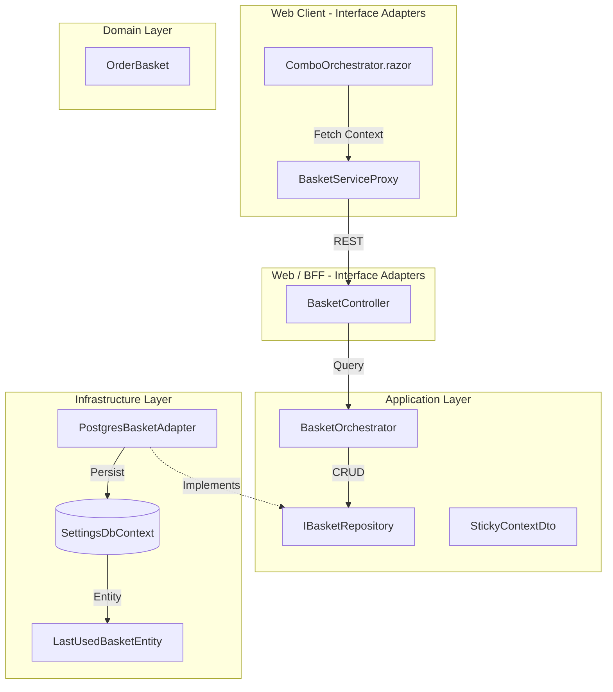
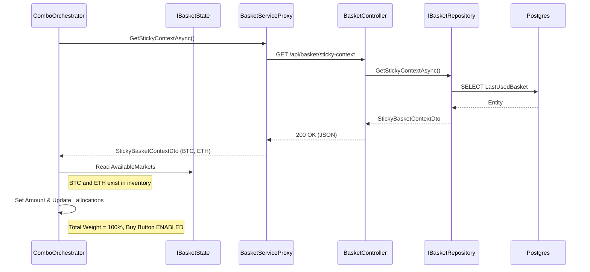
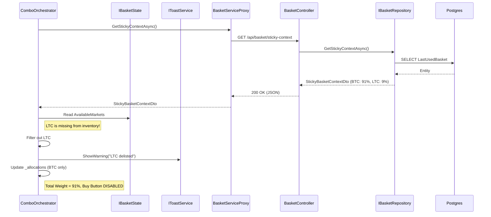

# RFC 001: Sticky Basket Persistence (Zero Data Entry Edition)

**Status:** Draft  
**Date:** 2024-05-20  
**Author(s):** Gemini

## 1. Executive Summary: The Vision & The Value
- **The What & The Why:** Users currently have to manually re-enter their preferred multi-asset allocations, amounts, and currency choices every time they use the app. This RFC proposes a "Sticky State" persistence layer that automatically remembers the full context of the last successfully executed basket.
- **Business & System ROI:** Transforms the app into an "Anticipatory Interface," achieving a "Zero Data Entry" experience for recurring investments. This significantly reduces trade friction and elevates user retention.
- **The Future State:** The user opens the app and their last strategy (e.g., the 7-asset combo, RM 1200, in MYR) is already waiting for them. One click to confirm, zero typing required.

## 2. The Status Quo & The Timebombs
- **The Urgency (Why Now?):** The current hardcoded 60/40 split is a friction point that disconnects the user's actual behavior from the app's starting state.
- **The Timebombs (Assumptions):**
    - **Context Stability:** We assume that repeating the *last* trade context (Amount + Currency + Assets) is the most desired behavior.
    - **Cross-Currency Resolution:** We assume the stored Asset Symbols can be re-resolved to Pairs even if the user manually switches currencies after rehydration.
    - **Asset Availability:** We assume that if an asset in the sticky state is delisted, the UI can gracefully handle its absence without breaking the entire load sequence.

## 3. Goals & The Scope Creep Shield
- **Goals:**
    - Automatically save the `TotalSpend`, `CounterCurrency`, and `Allocations` (Asset + Weight) upon successful execution.
    - Pre-fill all three components in the UI on initialization.
    - Ensure persistence is counter-currency agnostic (stores Assets, not Pairs).
- **Non-Goals (The Shield):**
    - **Named Templates:** No manual saving, naming, or template management UI. We explicitly reject speculative support for multiple templates.
    - **Category Labels:** `Category` metadata will not be persisted.
    - **History Tracking:** This is not a "Trade History" feature; it only remembers the absolute latest successful configuration.

## 4. Proposed Technical Design
### 4.1 Architecture & Boundaries

#### Static Boundaries

#### Dynamic Flow: Rehydration (Scenario 1: Happy Path)

#### Dynamic Flow: Rehydration (Scenario 2: Delisted Asset)

### 4.2 Architectural Layer Mutations (Clean Architecture)
The implementation will strictly adhere to a 1:1 "Last Used" schema to minimize complexity and avoid speculative design:

**1. Domain Layer (`Luno.MissionControl.Core`)**
- **Changes:** **NONE.** The domain remains pure and focused on the `OrderBasket` validation and execution logic.

**2. Application Layer (`Luno.MissionControl.Application`)**
- **DTOs:** Add `StickyBasketContextDto` (Header: `TotalSpend`, `CounterCurrency`) and `StickyAllocationDto` (Asset, Weight).
- **Ports:** Create `IBasketRepository` with `GetStickyContextAsync` and `SaveStickyContextAsync`.
- **Use Cases:** `BasketOrchestrator` uses these DTOs to bridge the gap between execution and persistence.

**3. Interface Adapters (`Luno.MissionControl.Web` & `Web.Client`)**
- **Controllers:** `BasketController` exposes the sticky context.
- **UI:** `ComboOrchestrator` rehydrates from the DTO. **MANDATORY:** Assets MUST be filtered against `State.AvailableMarkets`. Missing or delisted assets must be dropped from the UI state during rehydration to prevent execution-time `MarketNotFound` exceptions.

**4. Infrastructure Layer (`Luno.MissionControl.Infrastructure`)**
- **Persistence Entities:** Define `LastUsedBasketEntity` and `LastUsedBasketItemEntity`.
- **Database:** `SettingsDbContext` manages these entities in a strict 1:1 relationship (one header per user/system).

## 5. Execution, Rollout, & The Sunset (The Delivery DNA)
- **Phase 1: Foundation & Backward Compatibility**
  - **Description:** Build the 1:1 Infrastructure schema and models.
  - **Merge Gate:** Successful schema migration and unit tests proving the 1:1 upsert logic works cleanly.
- **Phase 2: Application Orchestration**
  - **Description:** Wire the "Save on Success" logic inside `BasketOrchestrator`.
- **Phase 3: UI Rehydration & Safety**
  - **Description:** Wire the frontend to fetch and hydrate the state.
  - **Safety Gate:** Rehydration MUST filter the persisted `AssetSymbols` against `IBasketState.AvailableMarkets`.
  - **Behavior:** Dropping a delisted asset will naturally result in a `TotalWeight < 100%`, which disables the "PURCHASE COMBO" button. This is a deliberate safety feature to force user acknowledgement of portfolio changes.
  - **Notification:** Show a warning toast if any assets were filtered out during rehydration.

## 6. Behavioral Contracts (The "Given/When/Then" Specs)
### 6.1 The Happy Path (Feature Success)
- **Tier:** Integration
+- **Given:** A trade of RM 1200 for 7 assets in MYR was successful.
+- **When:** The app is restarted.
+- **Then:** The UI explicitly shows "MYR", "1200", and all 7 assets correctly weighted.

### 6.2 The Chaos Path (Delisted Asset Handling)
- **Tier:** Unit
- **Given:** A sticky state containing "LTC" weight, but Luno has delisted LTC.
- **When:** The app is initialized.
- **Then:** The UI MUST drop the LTC allocation and load the remaining assets. It MUST NOT crash or allow an execution command to be sent with the invalid LTC asset.
- **Verification:** Unit test `ComboOrchestrator.Rehydrate` with a mocked market inventory that is missing one of the persisted assets.

## 7. Operational Reality (The Anti-P1 Guardrails)
- **Blast Radius:** If the `SettingsDbContext` fails, the app degrades to the hardcoded default view.
- **Capacity Breaking Points:** N/A (Fixed 1:1 schema).

## 8. Disaster Recovery & The Panic Button
- **The "Panic Button":** Rollback the Web Client. No database rollback required.

## 9. The Pre-Mortem & Trade-offs
- **Rejected Options:** **Named Templates (1:N Schema).** We explicitly reject the auditor's suggestion for a 1:N schema. We do not do speculative design; there is no foreseeable need for multiple templates, and a 1:1 schema is simpler, faster to implement, and perfectly satisfies the "Sticky" requirement.
- **The Pre-Mortem:** This fails if we don't handle the "Total Weight < 100%" state after filtering out a delisted asset. The UI must be robust enough to handle partial rehydration.

## 10. Definition of Done
- **Verification Strategy:** 
    - E2E Playwright test simulating an execution and verifying a subsequent page load contains the exact contextual data.
- **TDD Mandate:** **"We do not step forward without knowing where our foot will land."** 100% test pass on project-core. Total coverage of Behavioral Contracts (Section 6).
