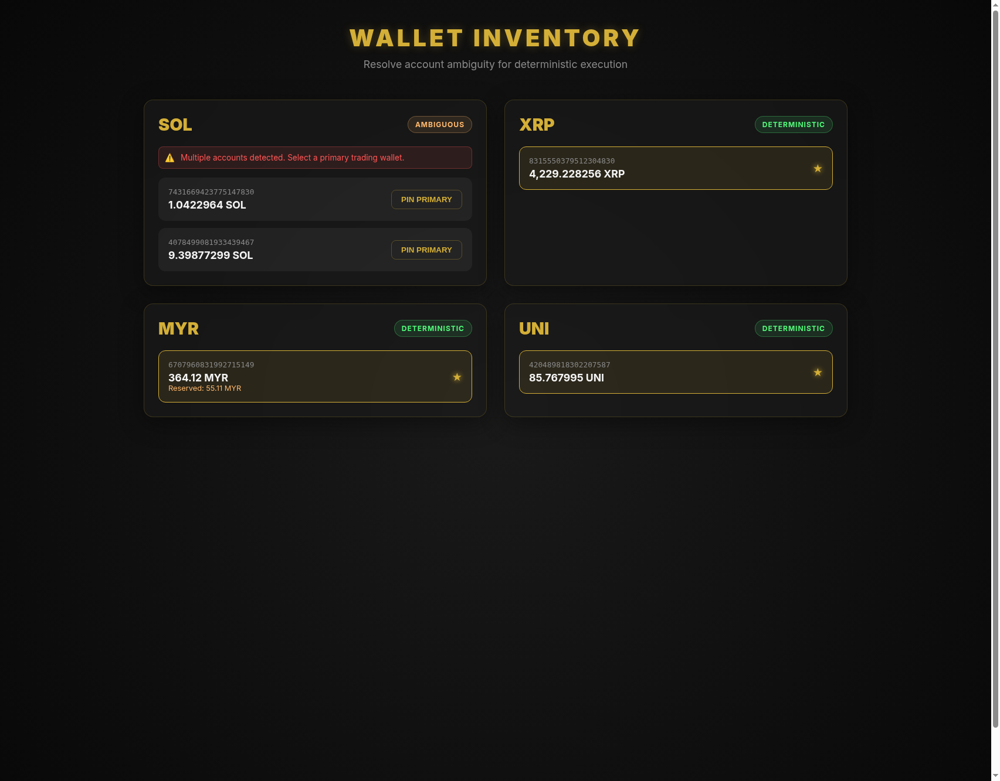
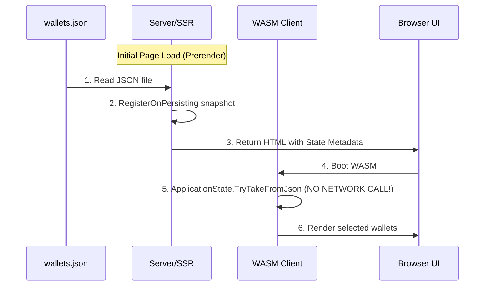
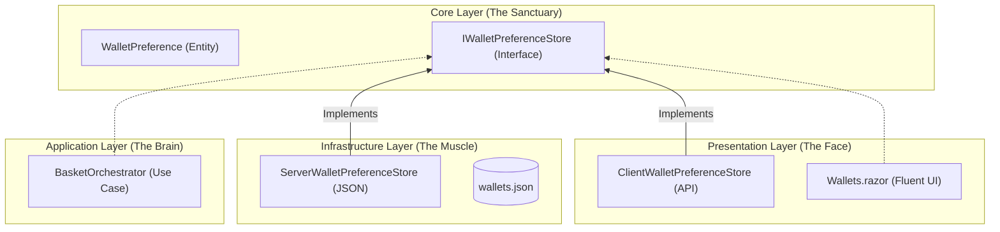

# 🏗️ Implementation Plan: Luno Mission Control Wallet Selection UI (Finalized)

## 🎨 Visual Mockup: The "Titan Heritage" Interface
To ensure we are aligned on the design, I've created a [standalone HTML mockup](./assets/wallets_hub.html) that follows our **Glassmorphism** and **Titan Heritage** palette (Obsidian & Gold).

### Key UI Features:
- **Crisis Detection:** Assets with multiple accounts (e.g., SOL) are flagged as `AMBIGUOUS` with a warning banner.
- **Pinning Logic:** Users can explicitly "Pin" a wallet to make it the `PRIMARY` trading account. Pinning a new account automatically swaps the choice (Exclusive Selection).
- **Visual Feedback:** `DETERMINISTIC` (single account) vs `PRIMARY` (user-pinned) badges provide clear state visibility.

## 📊 Architectural Blueprints

### The "Persistence Bridge" (Zero-Latency Rehydration)
> [!NOTE]
> **Why 0 API calls on WASM boot?**
> Blazor's `PersistentComponentState` allows us to "bake" the server-side data directly into the initial HTML.
> 1. **Server (SSR):** Reads `wallets.json` and API balances. Serializes data into a JSON block in the HTML.
> 2. **Client (WASM):** Instead of calling `HttpClient.GetAsync("/api/wallets")`, it reads the serialized JSON from the DOM.
> 3. **Result:** Instant rendering. No "Loading..." flickers or redundant network traffic.

### C3: Component Interaction (The "Unified Contract")

## 🎯 Goal
Resolve the **Account Ambiguity Crisis** by providing a premium UI for manual wallet pinning, ensuring 100% deterministic order execution.

## 👑 User Review Required
> [!IMPORTANT]
> **Durable Persistence:** We will define a bind mount in the AppHost that maps `../data` on the host to `/app/data` in the container. This ensures `wallets.json` survives deployments.

## 🛠️ Proposed Changes

### 1. Core & Infrastructure
- **[NEW]** `IWalletPreferenceStore`: Domain contract for persistence.
- **[NEW]** `WalletPreference`: Domain entity.
- **[MODIFY]** `AppHost`: Bind mount configuration for `/app/data`.
- **[NEW]** `ServerWalletPreferenceStore`: JSON persistence logic.

### 2. Application & Presentation
- **[MODIFY]** `BasketOrchestrator`: Use preferences for account resolution.
- **[NEW]** `Wallets.razor`: The Premium Hub UI (as seen in the mockup).
- **[NEW]** `WalletController`: Server-side endpoint for preference updates.

## ✅ Verification Plan

### 1. bUnit Component Specs (Behavioral)
- **`Crisis_Indicator_Should_Appear_For_Ambiguous_Assets`**: 
    - `[Fact(DisplayName = "Given an asset with multiple accounts, the Wallets Hub must display a high-visibility ambiguity warning to prevent non-deterministic order execution.")]`
- **`Pinning_A_Wallet_Should_Trigger_Store_Update`**: 
    - `[Fact(DisplayName = "When a user pins a specific account as primary, the preference store must persist the selection to ensure future trades are routed deterministically.")]`

### 2. Playwright Integration Specs
- **`BasketExecution_EndToEnd_Contract`**: 
    - `[Fact(DisplayName = "The Basket Orchestrator must resolve account IDs using the user's pinned preferences, ensuring the exact cryptographic identity is passed to the Luno API.")]`

### 3. Manual Verification
- **`Preference_Persistence_Across_Purge`**:
    1. Pin a wallet in the UI.
    2. Run `deploy.sh --purge`.
    3. Refresh the page and verify the pin remains (validating the bind mount).
- **Visual Audit:** Verify Glassmorphism transparency and micro-animations.
